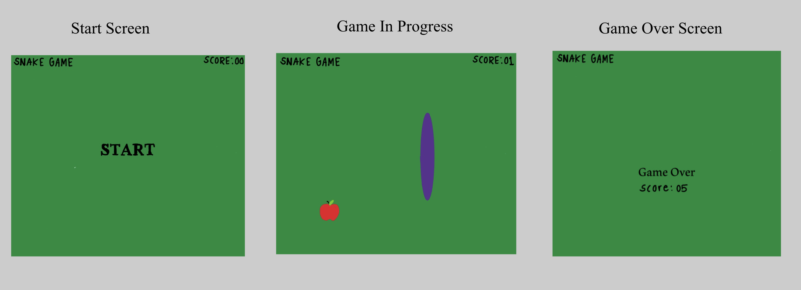
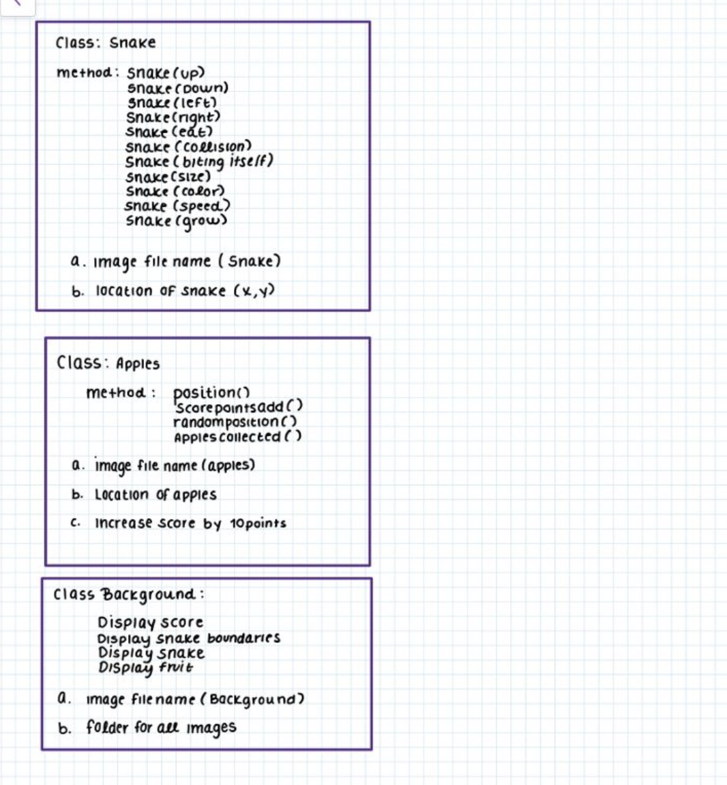

:warning: Everything between << >> needs to be replaced (remove << >> after replacing)
# CS110 Project Proposal
# Snake Game
## CS 110 Final Project
### Spring 2022
### [Assignment Description](https://docs.google.com/document/d/1H4R6yLL7som1lglyXWZ04RvTp_RvRFCCBn6sqv-82ps/edit#)

[Snake Game Presentation Repl](https://replit.com/@Brianna-OO/final-project-cs-geeklords#main.py) \
[Snake Game Presentation](https://docs.google.com/presentation/d/1KRhsGmiyhKvFk8tZsDDbPL1Xe0GopRUtqusd4xfNnnM/edit#slide=id.g11bf020bd32_0_0)
[Snake Game Presentation Demo](assests/ProjectDemo.mp4)

### Team: Geeklords
#### Erica Rodrigues, Julia Steckler, Brianna Sexton

***

## Project Description *(Software Lead)*

We decided to replicate the classic snake game as our final project. The basic idea of the snake game is a snake moves around a box trying to eat apple. Once the snake eats an apple, it grows in size, and a new apple is spawned for the snake to eat. The game is more complicated because if the snake runs into the boundaries of the box, the game is over. The user controls the direction of the snake's head (up, down, left, or right), and the snake's body follows.

***    

## User Interface Design *(Front End Specialist)*

*  Welcome and Game Over Screen Original Design:
  

* GUI Final Result:
  

***        

## Program Design *(Backend Specialist)*
 
* Class Interface Design
    * 

* Classes 
  * Controller: Runs the main loop for starting the game, playing the game, and exits when the snake collides into the wall or itself
  * Snake: Holds the position of the snake, size of snake, adds length to the snake when it eats an apple, holds conditions where the snake dies
  * Apples: Holds the position for the apples, spawns new apples at random locations, allows snake to collide with apples

## Project Structure *(Software Lead)*

The Project is broken down into the following file structure:

* main.py
* SCR: \
  pycache \
  snake.py \
  apples.py \
  controller.py \
  utility.py
  
    
  
* Assets
    * Apple
    * Background
* etc
***

## Tasks and Responsibilities *(Software Lead)*

   * You must outline the team member roles and who was responsible for each class/method, both individual and collaborative.

### Software Lead - Brianna Sexton

Worked as integration specialist by making sure that programming by front and back end specialist flows efficiently and clearly. Test game constantly to make sure all actions are working. Creates ATP and final demo once program is complete.

### Front End Specialist - Julia Steckler

Front-end specialist conducted significant research on the layout and design of game. Organized use of computer buttons for user to control their player. Creates efficient internal linking and user-friendly navigation of game and menus.

### Back End Specialist - Erica Rodrigues

The back end specialist specifically programs outcomes of actions taken from user. Programs what happens and how a user wins/loses game. Uses classes to organize actions.

## Testing *(Software Lead)*

* Constantly testing the game focusing on isolated features
    * first creating basic program, then testing after each individual feature is added (apples, background, etc.)
    * isolating certain program features when needed to be tested

## ATP
|Step|Procedure|Expected Results|Actual Results| 
|-------|:-------------:| -----------------:| -------------- |
|1|Press "Run" button displayed on on application|Display of main menu screen|Correct|
|2| Press "Play" button on main menu to begin game|Menu screen disappears and game screen displays. On the game screen there is a snake and apple.|Correct |
|3| Press Left arrow key on computer| Snake character moves left|Correct|
|4| Press Right arrow key on computer| Snake character moves right|Correct |
|5| Press up arrow key on computer| Snake character moves up|Correct |
|6| Press down arrow key on computer| Snake character moves down|Correct| 
|7| Move snake towards apple with arrow keys on computer to eat apple at randomly generated place| Snake grows in length, current apple is eaten and new apple spwans|Correct| 
|8| Move snake with arrow keys on computer to hit screen boundaries| Snake hits boundaries, and Game over screen appears|Correct|

REFERENCES:
https://riptutorial.com/pygame/example/18046/event-loop
https://www.geeksforgeeks.org/snake-game-in-python-using-pygame-module/
https://www.edureka.co/blog/snake-game-with-pygame/